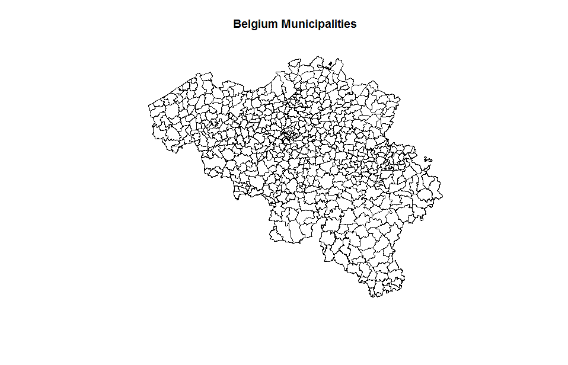
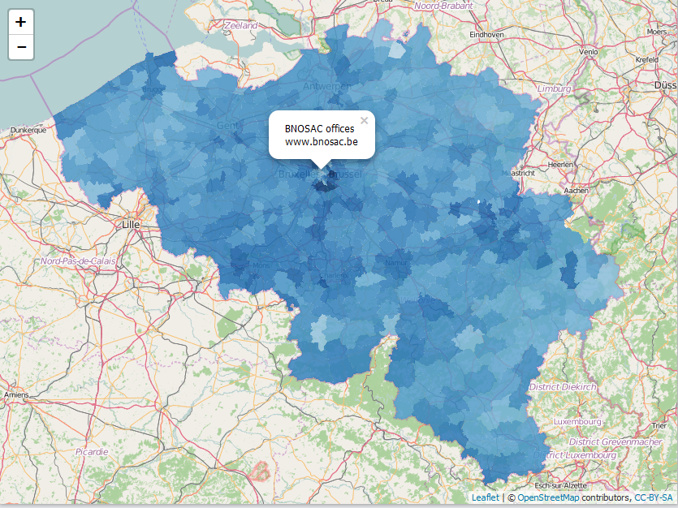

# Administrative boundaries of Belgium based on OpenStreetMap data

The BelgiumMaps.Admin R package allows R users to easily have data available containing **geographical administrative boundaries in Belgium**. It contains data available as part of OpenStreetMap (https://www.openstreetmap.org).

## License

**BelgiumMaps.Admin** is released under the Open Database License 1.0. http://opendatacommons.org/licenses/odbl/1-0/. You may use the data for any purpose, but you have to acknowledge OpenStreetMap as the data source.

## Installation

The package is available at datatailor.be
```
install.packages("BelgiumMaps.Admin", repos = "http://www.datatailor.be/rcube", type = "source")
```

To install the latest version from github:
```
devtools::install_github("jwijffels/BelgiumMaps.Admin", build_vignettes = TRUE)
## See the vignette
vignette("BelgiumMaps_AdministrativeAreas", package = "BelgiumMaps.Admin")
```

## Documentation of the BelgiumMaps.Admin package

This package contains data extracted from http://download.geofabrik.de/europe/belgium.html on 2015/11/03 with OpenStreetMap data up to 2015-11-02T22:22:02Z.

### Administrative boundaries

The belgium-latest.osm.pbf file was imported with osm2pgsql in PostGIS and converted to a shapefile with pgsql2shp to obtain shape files of polygons of administrative boundaries of administrative levels 2, 4, 6, 7, 8, 9. More information about administrative levels in OpenStreetMap: http://wiki.openstreetmap.org/wiki/Tag:boundary%3Dadministrative.
These administrative boundaries are made available in the BE_OSM_ADMIN dataset which can be found inside the package.

```
library(BelgiumMaps.Admin)
library(sp)
data(BE_OSM_ADMIN) 
plot(BE_OSM_ADMIN)
plot(subset(BE_OSM_ADMIN, admin.level == 8), main = "Belgium Municipalities")
str(as.data.frame(BE_OSM_ADMIN))
```


The BE_OSM_ADMIN spatial data contains NIS codes which where extracted from the ref:INS tag of the OpenStreetmap polygon. These can be used to link with the BelgiumStatistics NIS code identifier which is present in the data of the BelgiumStatistics package. This package can be found at https://github.com/jwijffels/BelgiumStatistics. Example shown below.

```
library(BelgiumStatistics)
library(BelgiumMaps.Admin)
library(data.table)
library(leaflet)

data(BE_OSM_ADMIN, package = "BelgiumMaps.Admin")
data(TF_SOC_POP_STRUCT_2015, package = "BelgiumStatistics")

x <- as.data.table(TF_SOC_POP_STRUCT_2015)
x <- x[, list(MS_POPULATION = sum(MS_POPULATION),
              Females = 100 * sum(MS_POPULATION[CD_SEX == "F"]) / sum(MS_POPULATION)),
       by = list(CD_MUNTY_REFNIS, TX_MUNTY_DESCR_NL, TX_MUNTY_DESCR_FR)]

mymap <- subset(BE_OSM_ADMIN, !is.na(tag.ref.ins))
myenrichedmap <- merge(mymap, x, by.x = "tag.ref.ins", by.y = "CD_MUNTY_REFNIS", all.x=TRUE, all.y=FALSE)
myenrichedmap <- subset(myenrichedmap, !is.na(Females))
pal <- colorNumeric(palette = "Blues", domain = myenrichedmap$Females)
leaflet(myenrichedmap) %>%
  addTiles() %>%
  addPolygons(stroke = FALSE, smoothFactor = 0.2, fillOpacity = 0.85, color = ~pal(Females)) %>%
  addPopups(lng = 4.366354, lat = 50.86619, popup="BNOSAC offices<br/>www.bnosac.be")
```



## More geospatial data from OpenStreetMaps

The BelgiumMaps.OpenStreetMap package contains more datasets which can be used alongside the administrative boundaries. Namely **landuse, natural, places, points, railways, roads and waterways**. 
This package can be found at https://github.com/jwijffels/BelgiumMaps.OpenStreetMap


## Do you need these boundaries in another format?

```
require(BelgiumMaps.Admin)
data(BE_OSM_ADMIN)

## As a shapefile
require(maptools)
writePolyShape(BE_OSM_ADMIN, fn = "BE_OSM_ADMIN")

## As a geojson
require(geojsonio)
geojson_write(BE_OSM_ADMIN, file = "BE_OSM_ADMIN.geojson", geometry = "polygon")
```

## Support in geospatial analysis

Need support in geospatial analysis or geospatial mapping. 
Contact BNOSAC: http://www.bnosac.be

